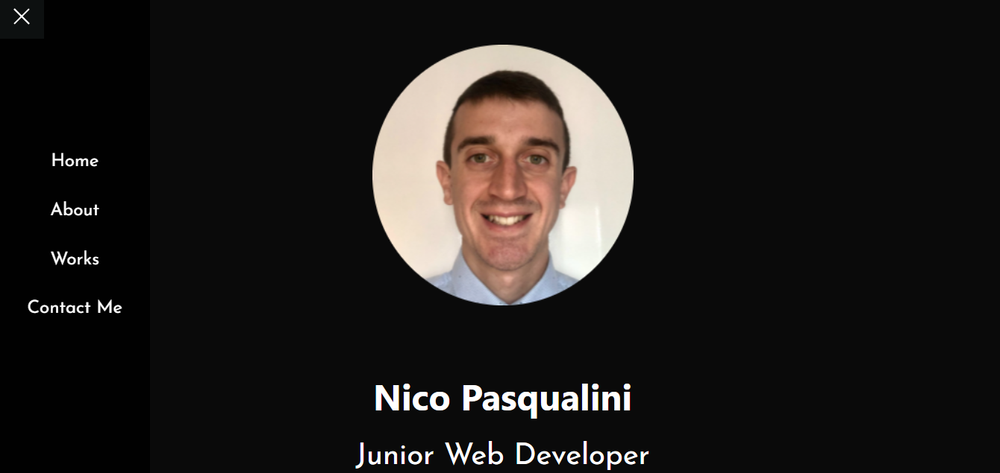

# Personal Portfolio

## Table of contents
* [General info](#general-info)
* [Technologies](#technologies)
* [Demo](#demo)
* [Room for Improvement](#room-for-improvement)
* [Working Application](#working-application)
* [License](#license)
* [Contact Me](#contact-me)

## General info

The portfolio contains a small intro, some recent projects and contact links. Each of the projects is presented with a brief description, a link to the correspondent GitHub repository, and the link to the deployed app. 

## Technologies

Project is created with:
* HTML
* JavaScript
* CSS

## Demo
<a href="https://nico749.github.io/Nico_Portfolio/" target="_blank">Click here</a> to go to the portfolio

## Room for Improvement

The application is working fine but it needs some tweaks for styling and displaying on mobile devices

## Working Application
The following image shows the web application's appearance:

## License

Distributed under MIT License.

## Contact me 
Created by [Nico Pasqualini](https://nico749.github.io/Personal-portfolio-/) - feel free to contact me!